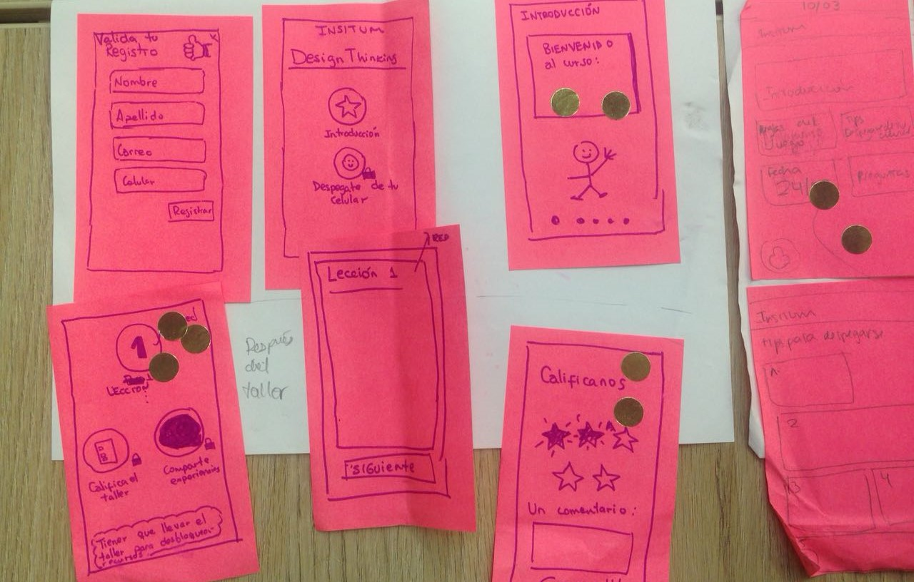

# Nuestra primera experiencia en un reto de User Experience Design

Durante el curso de User Experience Design en Laboratoria, a nuestro equipo nos dieron la oportunidad de diseñar una solución para INSITUM.

INSITUM es una consultora que brinda talleres de innovación a organizaciones líderes con una metodología centrada en el entendimiento y co-creación alrededor de las personas. Comparten material de información al inicio y al final de sus talleres, también del que se haya desarrollado durante el taller por correo electrónico mediante archivos adjuntos.

Ellos desean mejorar este proceso y tener un espacio del cual se pueda compartir esta información de manera más dinámica y amigable.

***

Estuvimos sumergidas en este proyecto durante 4 semanas para pensar, empatizar, analizar y diseñar nuestra solución para mejorar la experiencia de los participantes de los talleres.

Comenzamos a planear sobre cómo ejecutaremos el proceso de **investigación o descubrimiento**, realizamos entrevistas a personas que habían llevado un taller igual o similar al de INSITUM. También como un adicional, INSITUM nos brindó la oportunidad de poder presenciar uno de sus talleres, en el cual observamos la interacción de los participantes.

Al culminar nuestras entrevistas estos son algunas de las experiencias que obtuvimos:

> **“Aprendo más compartiendo experiencias y conocimientos”**

> **“¿Cómo comparto lo que aprendí en mi taller, si mi equipo es diverso?”**

> **“Siento que algunas cosas de aprendizaje no han evolucionado y son aburridos.”**

> **“Quisiera poder tener todos esos archivos en un solo espacio.”**

***

Juntamos toda la información recaudada en las entrevistas para **descubrir** insights valiosos y así comenzar a entender los problemas de nuestros usuarios para poder pensar en nuestra solución.

Primero realizamos los síntesis de las entrevistas con post-it: 

Después los agrupamos en el siguiente Affinity Map para descubrir patrones a medida que organizamos las ideas en forma de relaciones:

Con toda esta información creamos al User Persona que será la guía durante este proceso. Así nos es más fácil empatizar con el grupo de usuarios al que representa, y poder ofrecer soluciones más adecuadas a sus necesidades.

Tras los resultados de nuestra investigación, validamos que el reto inicial que nos dio INSITUM era el problema real de nuestros usuarios.

Entonces tenemos este how might we, que tienen la intención de convertir las necesidades y frustraciones de ‘Guillermo’ en oportunidades de mejora:

> **¿Cómo podríamos extender la experiencia del taller y mejorar la interacción con los recursos del antes y después del taller?**

***

Ahora pasamos a **idear posibles** soluciones. Cada integrante del equipo hizo un boceto (sketching) con su propuesta de solución.

Luego de la explicación de cada posible solución, se hizo como una “galería de arte” para hacer la votación de alguna parte específica de los bocetos que se acercaba más a la solución que estábamos buscando:

Por ende, después de la votación tomamos las ideas con más votos para poder **decidir cómo sería nuestro boceto final**:

Con esta información pasamos al realizar un prototipo más limpio usando [Figma](https://www.figma.com "Figma"), aplicamos un diseño simple y minimalista: 

***

En las siguientes imágenes explicamos como es el User Flow de todo la plataforma.

En ambos flujos tenemos 2 pantallas principales que son el login y la de antes y después del taller.

Para la primera etapa (antes del taller) tenemos 4 pantallas donde se comparte lo siguiente: un pequeña introducción de design thinking, unos vídeos para despegarse del celular, unos pequeños tips y por último información básica sobre el taller.

Para la segunda etapa tenemos tres vistas principales: las lecciones o temas impartidas en el taller, los materiales y vídeos que fueron compartidos o desarrollados y una sección de comunidad donde tendrán acceso a datos básicos de los participantes.

Las pantallas de lecciones y materiales tiene otro flujo interno donde se comparte información acerca de cada tema de forma más detallada.

Utilizamos [Marvel](https://marvelapp.com "Marvel") para hacer nuestro prototipo interactivo. [enlace al prototipo](https://marvelapp.com/5054j6h "prototipo")

Con esta propuesta nuestro objetivo es poder mejorar la experiencia del taller de nuestro User Persona ‘Guillermo’, hacer un proceso más entretenido al tener los materiales a la mano junto a un flujo simple, y cubra sus necesidades de aprendizaje.

***

Realizamos **un pequeño y rápido testing** y este fue el feedback que obtuvimos de nuestro público:

> **“En cuestión de diseño e interfaz, es entendible.”**

> **“Los colores están amigables, las iconografías están bien ejemplificados, tal vez lo botones(“continuar”) deban resaltar un poco más entre toda la sección que muestra”** 

> **“Como son talleres, no descargaría un app porque se almacena en mi celular pero si entraría a una web desde el.”**

***

####CONCLUSIONES

Todo el proyecto fue una experiencia de aprendizaje y crecimiento constante para nuestro equipo, estamos conscientes que nos falta mucho por aprender lo cual nos motiva a seguir aprendiendo de todos estos procesos de creación de soluciones y productos digitales.

También queremos agradecer a INSITUM por la paciencia al explicarnos más a detalle sobre reto para mejorar la experiencia para los participantes de sus talleres.

Finalmente. muchas gracias a todos por dejarnos compartir esta primera y genial experiencia.

***
#####EL EQUIPO

* Karol Orrillo | [Linkedin](https://www.linkedin.com/in/karol-orrillo/ "linkedin") - [Github](https://github.com/byOPKY "github") 
* Jennifer Jara | [Linkedin](https://www.linkedin.com/in/jenniferjara/ "linkedin") - [Github](https://github.com/jenniferjara "github")  
* Melissa Berrocal | [Linkedin](https://www.linkedin.com/in/melissa-berrocal/ "linkedin") - [Github](https://github.com/mel1bt "github")

***

pd. tambien realizamos un articulo en [Medium](https://medium.com/@jenniferjara/nuestro-primer-experiencia-en-un-reto-de-user-experience-design-79e564367eed "Medium") con nuestra experiencia. 
